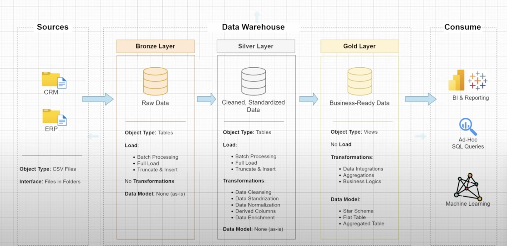

# Objective

Develop a modern data warehouse using SQL Server to consolidate sales data, enabling analytical reporting and informed decision-making.

Specifications

1. Data Sources: Import data from two source systems (ERP and CRM) provided as CSV files.
2. Data Quality: Cleanse and resolve data quality issues prior to analysis.
3. Integration: Combine both sources into a single, user-friendly data model designed for analytical queries.
4. Scope: Focus on the latest dataset only; historization of data is not required.
5. Documentation: Provide clear documentation of the data model to support both business stakeholders and analytics teams.

# Selecting Data Architecture
## Architecture Lvl 1
1. Data Warehouse
2. Data Lake
3. Data Lakehouse
4. Data Mesh

## Architecture Lvl 2
1. Inmon 
2. Kimball
3. Data Vault
4. Medallion Architecture

# Medallion Architecture
1. Bronze Layer
    Definition: Raw, unprocessed data as-is from sources
    Objective: Traceability & Debugging
    Object Type: tables
    Load Method: Truncate & Insert

2. Silver Layer
    Definition: Clean & Standardize data
    Objective: (intermediate layer) Prepare data for analysis
    Object Type: tables
    Load Method: Truncate & Insert

3. Gold Layer
    Definition: Business ready data
    Objective: Provide data to be consumed for reporting and Analytics
    Object Type: views
    Load Method: None

# Data Transformation
1. Bronze Layer - None
2. Silver Layer - Data Cleaning, Data Standardization, Data Normalization, Derived Columns, Data Enrichment
3. Gold Layer - Data Integration, Data Aggregation, Business Logic & Rules

# Data Modeling
1. Bronze Layer - None
2. Silver Layer - None
3. Gold Layer - Star Schema, Aggregated Tables, Flat Tables, Snowflake

# Target Audience 
1. Bronze Layer - Data Engineers
2. Silver Layer - Data Analysts, Data Engineers
3. Gold Layer - Data Analysts, Business Users

# Seperation of Concerns
While designing an architecture you have to break down complex system into smaller independent parts. and each part is responsible for the specific task and the main thing is the component of your architecture must not be duplicated so you cannot have 2 parts doing the same thing

that means bronze will do only ingestion, silver will only do cleaning and gold will only implement business logic

